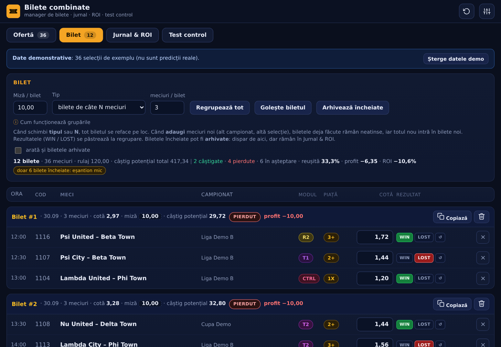
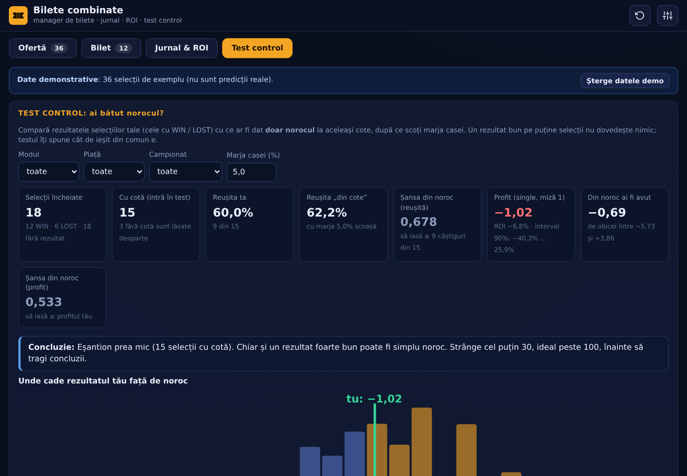
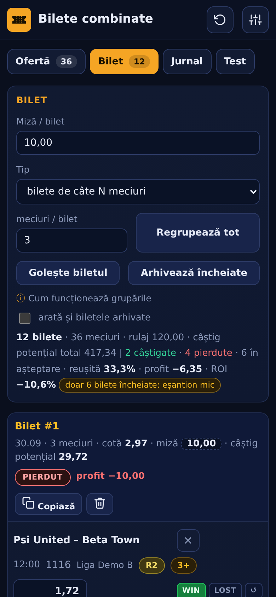

# 🎫 Bilete combinate

Manager de bilete de pariuri: îți ții selecțiile, le grupezi automat în bilete (de câte N meciuri), marchezi rezultatele
și vezi profitul, ROI-ul și, în **Test control**, dacă rezultatele tale sunt mai bune decât ce ar fi dat doar norocul.
Un singur fișier HTML: merge **offline**, pe **PC și pe telefon**, fără cont și fără server. Datele rămân în browserul tău.



| | |
|---|---|
|  |  |

> **Important:** programul **nu face predicții** și nu garantează câștiguri. Ține evidența biletelor tale și îți arată
> cinstit cât de mult din rezultate poate fi noroc. Pariurile implică risc de pierdere (18+): joacă doar cât îți permiți să pierzi.

## Cum îl folosești

1. **Ofertă**: adaugi selecțiile (manual, sau lipești rânduri din Excel / text: ora, cod, meci, campionat, modul, piață, cotă).
   Programul ghicește coloanele; le poți corecta în previzualizare. Selecțiile fără cotă sunt acceptate.
2. În Ofertă filtrezi (campionat, modul, piață, dată) și apeși **Adaugă la bilet**. Se creează bilete noi, de câte N meciuri.
3. **Bilet**: introduci cotele lipsă, marchezi **WIN / LOST** (↺ resetează, ANUL pentru meci anulat). Biletul își calculează
   cota, câștigul potențial, statusul și profitul. Selecțiile noi intră mereu în bilete noi: cele vechi rămân neatinse.
   Când schimbi **tipul** sau **N**, biletul se reface pe loc (rezultatele se păstrează).
4. **Arhivează încheiate**: biletele terminate dispar din Bilet, dar rămân în Jurnal.
5. **Jurnal & ROI**: profit, ROI, reușită, scădere maximă, grafic pe zile, clasamente pe modul / piață / campionat, istoricul biletelor.
6. **Test control**: ai bătut norocul? (vezi mai jos)

Extra: anulare cu **Ctrl+Z** (sau butonul ↶), copiere bilet ca text, export JSON / CSV, import JSON, miză diferită pe un bilet.

## Formule

- **Cota biletului** = produsul cotelor selecțiilor care au cotă. Cele fără cotă nu intră în produs (se arată „(1 fără cotă)”); cele anulate valorează 1,00.
- **Status:** PIERDUT dacă o selecție e pierdută; ÎN AȘTEPTARE dacă mai are selecții fără rezultat; ANULAT dacă toate sunt anulate; altfel CÂȘTIGAT.
- **Profit:** câștigat = miză × (cotă − 1); pierdut = −miză. **ROI** = profit / miza biletelor încheiate. **Reușită** = câștigate / (câștigate + pierdute).
- Cu mai puțin de 30 de bilete încheiate apare avertismentul „eșantion mic”.

## Test control: cum funcționează

Pentru selecțiile încheiate (WIN / LOST) care au cotă, programul scoate marja casei din cote (implicit 5%, se poate schimba) și
obține probabilitatea „corectă” de câștig a fiecărei selecții: `p = 1 / (cotă × (1 + marjă))`. Apoi:

- **Reușita așteptată** = media acestor probabilități; **p (reușită)** = probabilitatea ca doar norocul să dea cel puțin atâtea câștiguri
  (distribuție Poisson-binomială, calcul exact).
- **p (profit)**: 20.000 de simulări ale acelorași selecții, fiecare câștigând cu probabilitatea ei; câte dau un profit cel puțin cât al tău
  (miză egală pe fiecare selecție). Se afișează și intervalul de încredere 90% pentru ROI (bootstrap).
- **Pe module:** același test pentru fiecare modul, cu **corecție Bonferroni** (dacă testezi mai multe module, unul iese „norocos” din întâmplare)
  și, dacă ai selecții alese la întâmplare sub un modul de control (implicit `CTRL`), comparație cu acesta (test exact Fisher).
- Concluzia e prudentă: sub 30 de selecții cu cotă spune „eșantion prea mic”; arată și câte selecții trebuie ca un avantaj de +5 puncte să iasă din zgomot.

## Pe telefon

Deschide linkul în Chrome și alege **⋮ → Adaugă pe ecranul principal / Instalează aplicația**. Funcționează apoi și fără internet.
Fișierul `bilete-combinate.html` poate fi deschis și direct, de pe disc.

## Date și confidențialitate

Totul se salvează în `localStorage`-ul browserului (nu se trimite nimic nicăieri). Fă din când în când o **copie JSON** (Date și setări → Exportă);
dacă ștergi datele browserului, se pierd. Aplicația deschisă într-o previzualizare izolată (fără stocare) te avertizează.

## Dezvoltare

```
python3 build.py                 # asamblează bilete-combinate.html + dist/ (pentru găzduire)
node tests/logic.test.js         # teste pentru logică și statistică (inclusiv comparație cu scipy)
python3 tests/e2e.py             # teste în browser (Playwright/Chromium), cu verificări independente în Python
python3 tools/gh_device.py --token-file /tmp/t && python3 tools/publish_pages.py --token-file /tmp/t   # publică pe GitHub Pages
```
Cod: `src/logic.js` (calcule, fără DOM), `src/ui/*.js` (interfața), `src/style.css`, `src/template.html`.

## Limitări

- Nu aduce singur meciuri sau cote: le introduci tu (manual sau prin lipire).
- Testul control presupune selecții independente și cote reale; nu poate corecta alegerea selectivă a rezultatelor (dacă renunți la modulele care merg prost, testul nu mai e valid).
- Eșantioanele mici dau concluzii nesigure: de aceea programul le semnalează.
